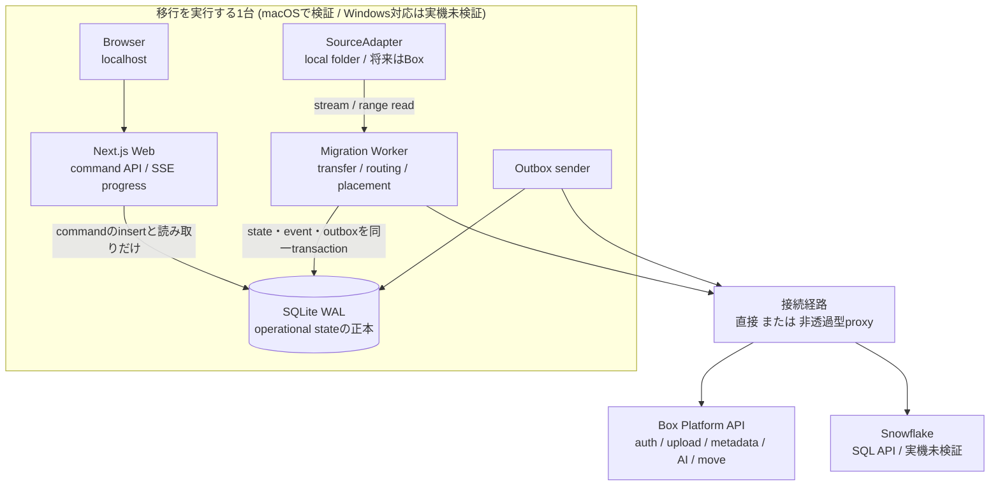
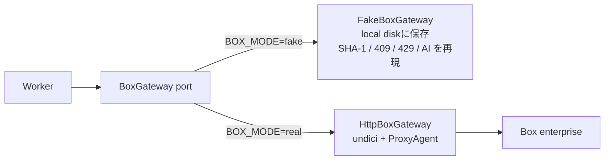
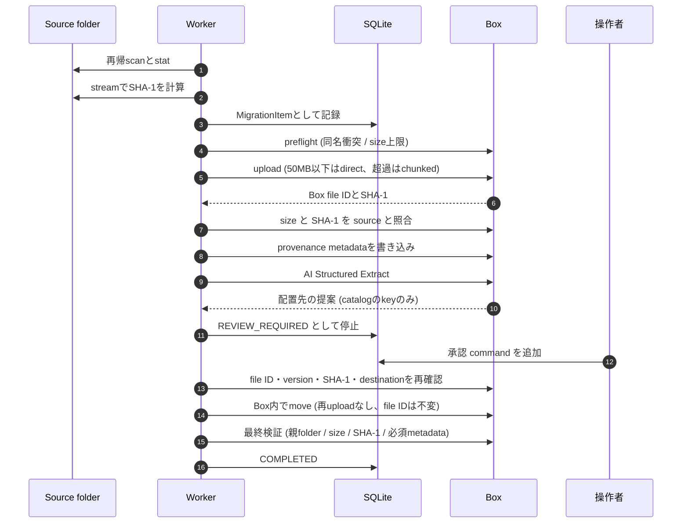
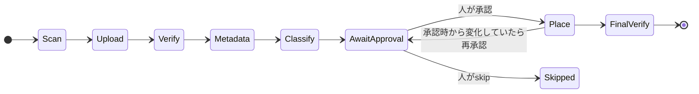
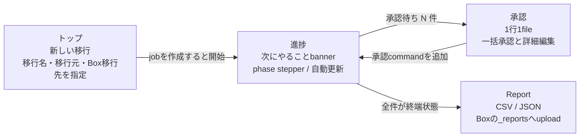
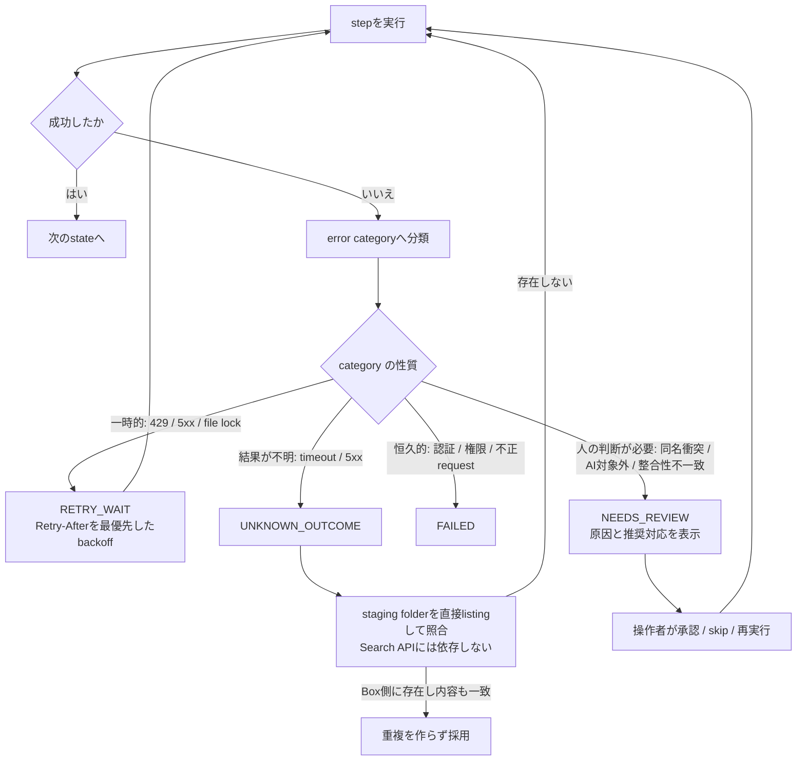

# Shuttle Lite

Shuttle Liteは、Box Shuttleが標準対応しにくい制約環境を補完する、Box Platform
ベースの軽量migration pathを実証するPoCです。

> Shuttleが届きにくい場所へ、軽やかに。

local fileをBoxへ移行し、書類種別に応じた業務メタデータを付与します。Box AIが許可済みの
配置先から候補を提案し、人の承認後に最終配置します。処理状態はlocalに保持し、
運用telemetryをSnowflakeへ記録します。

外部接続は直接でも、**非透過型（明示的）proxy経由でも動作します**。proxyは前提
条件ではありません。既定は直接接続で、proxyが必要な環境では設定で切り替えます。
proxy経由が義務付けられた環境向けには、直接接続へfallbackしない`required` mode
を用意しています。

## 書類別メタデータ

設定画面で、このアプリで使用する既存のBoxテンプレートを複数選択します。新規の移行では
Box AIが文書本文と候補の名前・項目を照合してテンプレートを選び、項目を自動抽出します。
承認画面でテンプレートを変更した場合も自動抽出し、抽出値は必要なときだけ詳細で確認・修正できます。
一覧でまとめて承認してからBoxへ付与します。内部の移行IDやSHA-1はローカルDBとレポートに保持します。
事前準備は [書類別メタデータの設定](docs/metadata-templates.md) を参照してください。
以下のMVP実測記録には、旧版の共通メタデータ方式の検証結果が含まれます。

## 現在地

**実Box enterpriseへの移行を、web UIからの操作で確認済みです。**

- fixture 32件 / 51.0 MB を実Boxへ移行。52MBのfileはchunked uploadで転送
- UIで「AI提案どおり30件をまとめて承認」を押し、worker がBox内moveと最終検証まで実行
- 配置された全件について、Box側のSHA-1・size・folder・元のfile名・必須metadataが一致
- 同じ検証を隔離環境で2回連続実行し、18項目すべて成功
- 非透過型proxy (Squid、Basic認証、宛先allowlist) 経由でも同じ18項目が成功。
  移行した51 MBはすべてproxyを通っており、direct接続へ抜けた通信はありません
- `BOX_MODE=fake` なら credential なしで同じpipelineを動かせる（22項目の検証が通る）

Snowflake SQL APIへの送信処理を実装しました。実アカウントでの検証は未実施です。
設定画面でAI分類・並列数・ログ出力先を変更できます。手順は[設定と処理ログ](docs/settings.md)を参照してください。
Windows固有の失敗（共有違反、Office lock file、
MAX_PATH、UNC）は実装済みですが実機では未検証で、検証は発表後に回しました。
デモはmacOS上で実演します。残作業は
[docs/integration-todo.md](docs/integration-todo.md)、検証状況は
[docs/acceptance.md](docs/acceptance.md)、残り期間の進め方は
[docs/plan-to-demo.md](docs/plan-to-demo.md) にまとめています。

## 実測でわかったこと

fake Boxでは22項目すべて通っていたのに、**実Boxでは初回に全32件が失敗しました。**
実機でしか出ない不具合が5件あり、いずれも修正済みです。

| 症状 | 原因 |
|---|---|
| 全件がupload時に400 | `content_modified_at` のミリ秒付きISOをBoxが拒否する |
| metadata書き込みが400 | Box AIが返す `2026-04-01` を date field が受け付けない |
| AI対象外fileがFAILED | 実Boxは対象外形式にも汎用の `Bad request` を返す |
| 長時間uploadが即FAILED | `ERR_HTTP2_STREAM_ERROR` をUNKNOWN扱いにしていた |
| retry後にupload 409で停止 | 結果不明のuploadを自分の以前のuploadと照合していなかった |

Box AIの実測（PDF 15件、`npm run measure:ai`）はこうなりました。

- extractが通るまで平均3.3秒。**`AI_NOT_READY` (202) は0回**で、representation待ちは発生しない
- **`confidence` は返らない**（15件すべてnull）。confidence前提のUIにしていたら作り直しだった
- 配置先は、判断した14件すべて正解。**catalog外のkeyは一度も返らない**
- 手掛かりの無い1件は`NEEDS_REVIEW`を返し、**推測せずに人へ渡す**
- 同名の`keiyakusho.pdf`を、中身を見てLegalとSalesへ振り分ける
- 契約番号・請求番号・社員番号と日付を正確に抽出する
- `documentType` は日本語で返るが**字体が揺れる**。「従業員記録」が繁体字の
  「從業員記錄」で返った。field descriptionで字体まで指定して解消した

非透過型proxy (Squid) 経由でも同じ検証を通しました。ここでも2件の不具合が出ました。

| 症状 | 原因 |
|---|---|
| proxyの407が `UNKNOWN` になる | undiciはCONNECTの失敗のstatusをmessageにしか入れない |
| `check:proxy` だけ分類が出ない | workerと別のerror処理を通っていた |

分類が出ないと「proxyのpasswordが違う」のか「proxyに届いていない」のかが
運用者に判断できません。いまは `PROXY_AUTH` (407)、`PROXY_CONNECT` (到達不能、
allowlist拒否)、`PROXY_TLS` を区別します。

詳細は [docs/decisions.md](docs/decisions.md) のQ-004実測結果と
[docs/acceptance.md](docs/acceptance.md) の「proxy経由での実測」を参照してください。

## 全体構成

1台のmachine上で、UIと転送処理を別processに分けています。Web側は状態を書き換えず、
長時間かかる処理はすべてWorkerが担当します。



Box APIへのaccessは`BoxGateway`という1つのportに集約しています。`BOX_MODE`で実装を
切り替えるため、credentialがなくてもpipeline全体を動かせます。



## 1つのfileが辿る流れ

転送は自動で進み、**配置の直前で必ず人の判断を待ちます**。承認後もworkerが対象の
同一性を再確認してから移動します。



状態遷移を短くまとめると次のとおりです。`承認待ち`より先へは、人の操作なしには
進みません。



## 画面の流れ

移行一覧から移行を開始し、進捗・承認画面へ進みます。共通設定は設定画面で編集・保存します。



| 画面 | 見えるもの | できること |
|---|---|---|
| トップ | 移行の一覧、進捗bar、次にやること | 移行名・移行元を入力して開始 |
| 進捗 | 完了 / 承認待ち / 失敗の件数、phaseごとの滞留、転送速度とETA、最近のevent | 一時停止、再開、失敗の再実行、report出力 |
| 承認 | file名、AI提案、confidence、抽出値、SHA-1、Box file ID | 一括承認、個別承認、配置先の変更、metadata修正、skip |

操作はすべてcommandとしてSQLiteへ記録され、workerが実行します。UIから直接state
を書き換える経路はありません。

## 失敗したときの扱い

errorはcategoryへ分類し、自動で再試行するもの、人の判断が必要なもの、恒久的な
失敗を区別します。結果が不明な通信は、Box側を照合してから再開します。



## 動かす

実Boxへの接続はCCGに加え、`.env` の `BOX_ACCESS_TOKEN` にアクセストークンを
設定する方式にも対応しています。読み取り専用の `npm run check:box` で認証を確認できます。
設定と差し替え手順は [.envのアクセストークンでBoxに接続する](docs/access-token-setup.md) を参照してください。

```sh
npm install
cp .env.example .env          # 既定は BOX_MODE=fake で credential 不要
npm run fixtures              # synthetic な 31 件を生成（52MB の chunked 検証用を含む）
npm run fixtures:pdf          # 業務文書らしいPDFを15件生成（demoとBox AI検証用）
npm run dev                   # web (http://localhost:3000) と worker を別 process で起動
```

http://localhost:3000 の「新しい移行」で移行名を入力し、「フォルダーを選択」から
Mac標準の選択画面で移行元を選びます。続けて「Boxから選択」で既存の移行先フォルダーを
開き、「このフォルダーを選択」を押します。「移行を開始」でworkerがscanから実行します。
パスの手入力や移行元の事前登録は不要です。フォルダーの選択だけでは移行は始まりません。
選択ダイアログはアプリを起動したMacに表示されるため、同じMacのブラウザーを使います。
Webはローカル接続で起動します。Windows・Linuxでのフォルダー選択は未対応です。
AI分類・同名ファイルの扱い・操作者名は「詳細オプション」にまとめています。
設定画面はBox接続などの共通設定のみです。配置先は移行ごとに選択します。
AIは選んだフォルダーと、その配下の既存フォルダーの名前・階層を参照します。
判断できない文書は確認待ちに残り、最終配置には必ず承認が必要です。
実Boxでは `config/destinations.json` のデモ分類を読み込まず、分類先を自動作成しません。
一時保管先・レポート用の内部フォルダー作成は従来どおり行います。
候補は選択範囲全体を取得し、移行作成時に保存します。200フォルダー・20階層を超える場合や
読み取れない階層がある場合は開始せず、範囲を選び直します。
移行先が未設定の過去の実Boxジョブは開始・再開できません。履歴とファイルを残したまま、
「新しい移行」で移行先を選びます。既存のBoxフォルダーやファイルは削除しません。
全件がreview待ちになったら承認画面で「AI提案どおりN件をまとめて承認」を押すと、
Box内moveと最終検証まで進みます。

```sh
npm test                      # 118 件のunit / pipeline test
npm run verify -- --faults    # fake Boxへ全件移行し、保存されたbyteと照合する
npm run verify -- --real      # 実Box enterpriseへ全件移行し、Box側と照合する
npm run verify:box            # 実Boxとの疎通確認（1 fileだけ往復させる）
npm run measure:ai            # 実BoxでBox AIの待ち時間と抽出精度を測る
npm run typecheck
npm run demo:reset            # local stateを初期化してfixtureを作り直す
npm run check:proxy           # proxy経路の確認（Box auth / API / uploadへ到達できるか）
npm run squid:start           # 検証用の非透過型proxyを立てる（squid:log / squid:stop）
npm run bootstrap:box         # Box folder layoutとmetadata templateを作成
```

`npm run verify` は隔離した環境でfixture 32件を最後まで移行し、**pipelineが記録した
値を使わずに**結果を検証します。fake modeでは保存されたbyteからSHA-1を再計算し、
実Boxではserver側が算出したSHA-1と突き合わせます。429・crash復旧・metadata失敗の
シナリオを含めてfake で22項目、実Boxで18項目を確認します。

実Boxでは実行ごとに `/Shuttle Lite/_verify/<実行時刻>/` を作り、その下に本番と同じ
layoutを組みます。本番のdestinationsを汚さず、何度流しても同名衝突しません。
結果は [docs/acceptance.md](docs/acceptance.md) を参照してください。

`BOX_MODE=fake`ではBoxの代わりに`.shuttle-lite/fake-box/`へcontentを保存します。
SHA-1、同名409、chunked session、AI extract、429とRetry-After、representation
pendingを再現するので、crash recoveryや重複防止をcredentialなしで検証できます。

## Product boundary

MVPは一つのlocal folderと一つのBox enterpriseを対象にします。Box Shuttle内部とは
連携せず、permission、ownership、full version history、多数のconnector、
petabyte-scale機能は再実装しません。

Platformはcross-platformを維持し、Windows固有の失敗も実装に織り込んでいます。
ただし実機検証は発表後に回したため、現時点でWindows対応をsupportedとは言いません
（[D-014](docs/decisions.md)、[D-016](docs/decisions.md)、[docs/windows.md](docs/windows.md)）。
Box-to-Boxは実装しませんが、sourceを差し替えられるseamを用意しています
（[D-015](docs/decisions.md)、[docs/box-to-box.md](docs/box-to-box.md)）。

## Documents

- [要件](docs/requirements.md)
- [Architecture](docs/architecture.md)
- [データモデルと処理の流れ](docs/data-model.md)
- [決定事項と確認待ち](docs/decisions.md)
- [実装順序](docs/implementation-plan.md)
- [9/30 発表までの計画](docs/plan-to-demo.md)
- [受け入れ基準の検証状況](docs/acceptance.md)
- [System連携 TODO](docs/integration-todo.md)
- [Windows運用](docs/windows.md)
- [Box-to-Box の設計](docs/box-to-box.md)
- [別のAI assistantへの引き継ぎ](docs/handoff.md)（`npm run pack` でzipを作る）

## Repository structure

```text
apps/
  web/          Next.js local UI、command API、SSE progress、承認画面
  worker/       Job claim、transfer/routing/placement queue、recovery、report
    src/source/ SourceAdapter port と LocalSourceAdapter
packages/
  core/         State machine、error category、backoff、naming、progress
  db/           SQLite schema、repository、worker lease、transactional outbox
  box/          BoxGateway port、HTTP実装 (undici)、Fake実装、folder layout
  config/       Env検証、ProxyProfile、destination catalog
  routing/      Extraction schema、destination制約、approval検証、metadata
  telemetry/    Payload allowlist、outbox sender、progress projection、report
infra/
  squid/        明示的proxyの検証環境
fixtures/
  source/       Synthetic migration files（gitignore）
config/
  destinations.json  fake Box・合成デモ専用の分類例
docs/
scripts/
```

## 設計の要点

- **SQLiteが正本**。state更新とtelemetry outboxへのinsertを同一transactionで確定するため、
  Snowflakeが止まってもtelemetryを失わず、migrationも止まりません。
- **UIはstateを書き換えません**。操作はcommandとして記録し、workerだけがstateを変更します。
- **AIは提案のみ**。destinationは許可済みcatalogのkeyに限定し、moveは人の承認後に、
  workerがfile ID・version・metadata・destinationを再確認してから実行します。
- **Unknown outcomeはstaging folderの直接listingで照合**します。即時反映を保証しない
  Search APIには依存しません。
- **Telemetryはallowlist方式**。file content、credential、AI応答全文、絶対pathは
  送信対象に含まれません。

## Safety

Sourceはread-onlyとして扱い、削除もmirror deleteもしません。同名fileを上書きしません。
配置先に同名があるときは、Box Shuttleと同じく改名して両方残すか、skipして後で対応します
（[D-017](docs/decisions.md)）。Credentialとproxy passwordはprofileにもlogにもevent payloadにも残りません。
Demoはsynthetic dataのみを使用します。
