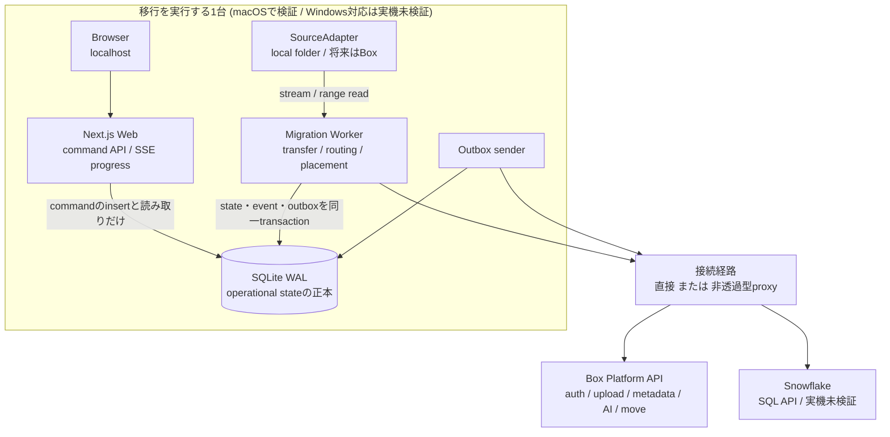
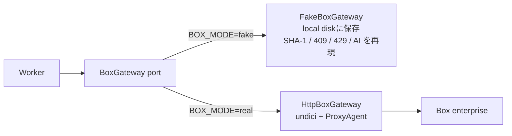
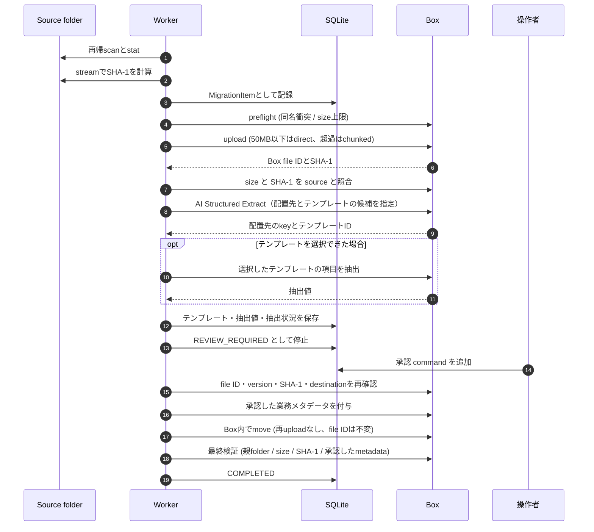
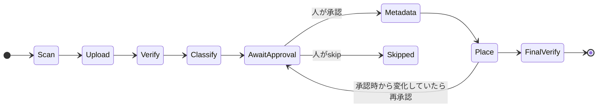
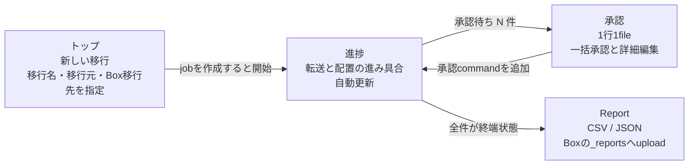
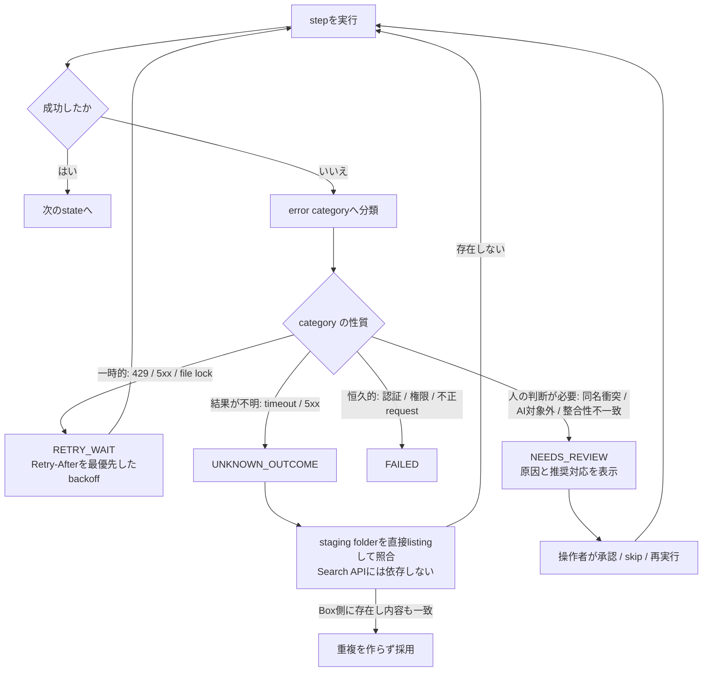

# Shuttle Lite

Shuttle Liteは、Box Shuttleが標準対応しにくい制約環境を補完する、Box Platform
ベースの軽量migration pathを実証するPoCです。

> Shuttleが届きにくい場所へ、軽やかに。

ローカルフォルダーのファイルをBoxへ移行し、文書に合う業務メタデータを付与します。
「AIで整理して移行」ではBox AIが配置先とメタデータテンプレートを提案し、人の承認後に最終配置します。
「そのまま移行」では元のフォルダー構成を維持して移行します。
処理状態はローカルのSQLiteに保持し、処理ログはローカルフォルダーまたはSnowflakeへ出力します。

## 利用の流れ

**AIで整理して移行: アップロード → AI分類 → 確認・承認 → 配置**

1. Macの`.env`でBox認証を設定し、アプリを起動します。認証方式はCCGまたはアクセストークンです。
2. 「設定」で使用するBoxメタデータテンプレートを複数選択します。AI分類・並列数・ログ出力先もここで設定します。
3. 「新しい移行」で移行方式、移行名、Macの移行元フォルダー、Boxの移行先を指定します。以下の4〜6は「AIで整理して移行」の流れです。
4. ファイルをBoxの一時保管先へアップロードし、Box AIが配置先・テンプレートを選んで項目を抽出します。
5. 承認一覧で提案を確認し、チェックボックスでまとめて承認します。抽出値は必要なときだけ「項目を確認・編集」を開きます。
6. 承認したメタデータを付与して最終フォルダーへ移動し、内容と配置結果を検証します。ファイルIDは維持し、再アップロードしません。

元ファイルは残します。同名ファイルは既定で改名し、除外も選べます。通常の「そのまま移行」では
「上書き（新しいバージョン）」も選択できます。AI方式の上書きは行いません。
「AIで整理して移行」でAI分類をオフにした場合も自動配置はせず、承認画面で配置先を指定します。

**そのまま移行: アップロード → 転送検証 → 配置 → 最終検証**

「新しい移行」で「そのまま移行」を選びます。例えば移行元が`営業資料/契約書/A社.pdf`、
移行先がBoxの`移行データ`なら、`移行データ/営業資料/契約書/A社.pdf`に配置します。
元フォルダー名と配下の階層・空フォルダーを維持し、同名フォルダーは再利用、不足分を作成します。
AI分類・メタデータ付与・ファイルごとの承認は行いません。設定画面のテンプレート選択も不要です。
新規ファイルはstagingへの転送・検証後、同じfile IDのまま配置します。既存ファイルの更新は
既存IDへ直接versionを追加し、内容と配置を検証します。並列数、一時停止・再開は既存の設定を使います。
移行中に配置先が削除・改名・移動された場合は停止します。テスト終了時もフォルダーは残し、追跡できた転送ファイルだけを削除します。
移行元の隠し項目・シンボリックリンク・Officeロックファイルは、既存のスキャンと同じく対象外です。
ローカルの所有者・アクセス権は移行しません。

事前設定と移行ごとの入力は分けています。詳細は[設定](docs/settings.md)と
[メタデータの準備](docs/metadata-templates.md)を参照してください。

外部接続は直接でも、**非透過型（明示的）proxy経由でも動作します**。proxyは前提
条件ではありません。既定は直接接続で、proxyが必要な環境では設定で切り替えます。
proxy経由が義務付けられた環境向けには、直接接続へfallbackしない`required` mode
を用意しています。

## 書類別メタデータ

設定画面で、このアプリで使用する既存のBoxテンプレートを複数選択します。新規の移行では
Box AIが文書本文と候補の名前・項目を照合してテンプレートを選び、項目を自動抽出します。
承認画面でテンプレートを変更した場合も自動抽出し、抽出値は必要なときだけ詳細で確認・修正できます。
一覧でまとめて承認してからBoxへ付与します。内部の移行IDやSHA-1はローカルDBとレポートに保持します。
事前準備は [書類別メタデータの設定](docs/metadata-templates.md) を参照してください。
以下のMVP実測記録には、旧版の共通メタデータ方式の検証結果が含まれます。

## 差分移行

通常の「そのまま移行」を終了した後、進捗画面の「差分を確認」で追加・更新・未転送分を確認し、
「差分を移行」で選択した対象を反映します。一部失敗を含む完了でも利用できます。
初回と各差分の実行履歴・CSV・JSONは保持します。JSONには各回の差分一覧も含めます。
一覧には同じ移行を1件だけ表示し、最新の実行を開きます。

- 前回成功したBoxファイルIDに新しいバージョンを追加。改名保存したファイルもそのIDを追跡します。
- Boxだけの変更は維持。双方の変更やBox側の削除・移動・改名は「要対応」です。
- 元で削除してもBox側は削除しません。元での改名・移動は新規パスとして扱います。
- 更新しないファイルはチェックを外せます。全体を再走査・ハッシュ比較するため確認時間はかかります。
- AI方式・テストモード・実行中・一時停止中は対象外。移行元と移行先は変更できません。
- 結果未確定の過去の転送は、実行履歴から失敗分を再試行して照合します。
- 新versionで業務メタデータは自動更新しません。既存の抽出値と内容が一致するかは別途確認が必要です。
- PCにマウントした共有フォルダーも同じ読取処理を使います。共有の到達・走査失敗は一覧確定前に停止します。
  実SMBの切断復帰・Windows実機は未検証です。

## 検証状況

2026-09-25、差分移行・version更新を含めて自動テスト528件、型チェック・lint、
本番ビルドが成功しました。既存方式のfake Box検証18項目も成功しています。
差分移行の実Box確認は未実施です。[Mac確認手順](docs/delta-migration.md)に沿って確認してください。

2026-09-24、「そのまま移行」を含めて自動テスト509件、型チェック・lintが成功しています。
既存方式のfake Box検証18項目、本番ビルド（webpack・認証設定を含まない隔離コピー）も成功しています。
新方式は階層維持、空フォルダー、衝突、停止・再開、移動応答喪失からの復旧をfake Boxで確認しました。実Boxでの確認はMac側で行います。
これは最新のAI選択精度を実Boxで検証したという意味ではありません。

**旧メタデータ方式では、実Boxへの移行とSquid経由の通信を確認済みです。**
以下は旧版の実測記録です。最新のテンプレート自動選択・抽出・承認画面は、Mac側での実Box確認が必要です。

- fixture 32件 / 51.0 MB を実Boxへ移行。52MBのfileはchunked uploadで転送
- UIで「AI提案どおり30件をまとめて承認」を押し、worker がBox内moveと最終検証まで実行
- 配置された全件について、Box側のSHA-1・size・folder・元のfile名・必須metadataが一致
- 同じ検証を隔離環境で2回連続実行し、18項目すべて成功
- 非透過型proxy (Squid、Basic認証、宛先allowlist) 経由でも同じ18項目が成功。
  移行した51 MBはすべてproxyを通っており、direct接続へ抜けた通信はありません
- `BOX_MODE=fake` なら credential なしで同じpipelineを動かせる（22項目の検証が通る）

Snowflake SQL APIへの送信処理を実装しました。実アカウントでの検証は未実施です。
設定画面でAI分類・並列数・ログ出力先を変更できます。手順は[設定と処理ログ](docs/settings.md)を参照してください。
Windows固有の失敗（共有違反、Office lock file、
MAX_PATH、UNC）は実装済みですが実機では未検証で、検証は発表後に回しました。
デモはmacOS上で実演します。残作業は
[docs/integration-todo.md](docs/integration-todo.md)、検証状況は
[docs/acceptance.md](docs/acceptance.md)、残り期間の進め方は
[docs/plan-to-demo.md](docs/plan-to-demo.md) にまとめています。

## 実測でわかったこと

fake Boxでは22項目すべて通っていたのに、**実Boxでは初回に全32件が失敗しました。**
実機でしか出ない不具合が5件あり、いずれも修正済みです。

| 症状 | 原因 |
|---|---|
| 全件がupload時に400 | `content_modified_at` のミリ秒付きISOをBoxが拒否する |
| metadata書き込みが400 | Box AIが返す `2026-04-01` を date field が受け付けない |
| AI対象外fileがFAILED | 実Boxは対象外形式にも汎用の `Bad request` を返す |
| 長時間uploadが即FAILED | `ERR_HTTP2_STREAM_ERROR` をUNKNOWN扱いにしていた |
| retry後にupload 409で停止 | 結果不明のuploadを自分の以前のuploadと照合していなかった |

Box AIの実測（PDF 15件、`npm run measure:ai`）はこうなりました。

- extractが通るまで平均3.3秒。**`AI_NOT_READY` (202) は0回**で、representation待ちは発生しない
- **`confidence` は返らない**（15件すべてnull）。confidence前提のUIにしていたら作り直しだった
- 配置先は、判断した14件すべて正解。**catalog外のkeyは一度も返らない**
- 手掛かりの無い1件は`NEEDS_REVIEW`を返し、**推測せずに人へ渡す**
- 同名の`keiyakusho.pdf`を、中身を見てLegalとSalesへ振り分ける
- 契約番号・請求番号・社員番号と日付を正確に抽出する
- `documentType` は日本語で返るが**字体が揺れる**。「従業員記録」が繁体字の
  「從業員記錄」で返った。field descriptionで字体まで指定して解消した

非透過型proxy (Squid) 経由でも同じ検証を通しました。ここでも2件の不具合が出ました。

| 症状 | 原因 |
|---|---|
| proxyの407が `UNKNOWN` になる | undiciはCONNECTの失敗のstatusをmessageにしか入れない |
| `check:proxy` だけ分類が出ない | workerと別のerror処理を通っていた |

分類が出ないと「proxyのpasswordが違う」のか「proxyに届いていない」のかが
運用者に判断できません。いまは `PROXY_AUTH` (407)、`PROXY_CONNECT` (到達不能、
allowlist拒否)、`PROXY_TLS` を区別します。

詳細は [docs/decisions.md](docs/decisions.md) のQ-004実測結果と
[docs/acceptance.md](docs/acceptance.md) の「proxy経由での実測」を参照してください。

## 全体構成

1台のmachine上で、UIと転送処理を別processに分けています。Web側は設定・移行の作成と
操作要求を保存します。ファイルの移行状態を進める処理はWorkerが担当します。


```mermaid
flowchart TB
  subgraph machine ["移行を実行する1台 (macOSで検証 / Windows対応は実機未検証)"]
    browser["Browser<br/>localhost"]
    web["Next.js Web<br/>command API / SSE progress"]
    worker["Migration Worker<br/>transfer / routing / placement"]
    sqlite[("SQLite WAL<br/>operational stateの正本")]
    src["SourceAdapter<br/>local folder / 将来はBox"]
    outbox["Outbox sender"]
  end

  proxy["接続経路<br/>直接 または 非透過型proxy"]
  box["Box Platform API<br/>auth / upload / metadata / AI / move"]
  snow["Snowflake<br/>SQL API / 実機未検証"]

  browser --> web
  web -->|"commandのinsertと読み取りだけ"| sqlite
  worker -->|"state・event・outboxを同一transaction"| sqlite
  src -->|"stream / range read"| worker
  worker --> proxy
  outbox --> sqlite
  outbox --> proxy
  proxy --> box
  proxy --> snow
```

Box APIへのaccessは`BoxGateway`という1つのportに集約しています。`BOX_MODE`で実装を
切り替えるため、credentialがなくてもpipeline全体を動かせます。


```mermaid
flowchart LR
  worker["Worker"] --> port["BoxGateway port"]
  port -->|"BOX_MODE=fake"| fake["FakeBoxGateway<br/>local diskに保存<br/>SHA-1 / 409 / 429 / AI を再現"]
  port -->|"BOX_MODE=real"| http["HttpBoxGateway<br/>undici + ProxyAgent"]
  http --> box["Box enterprise"]
```

## 1つのfileが辿る流れ

「AIで整理して移行」の転送は自動で進み、**配置の直前で人の判断を待ちます**。承認後もworkerが対象の
同一性を再確認してから移動します。


```mermaid
sequenceDiagram
  autonumber
  participant S as Source folder
  participant W as Worker
  participant D as SQLite
  participant B as Box
  participant H as 操作者

  W->>S: 再帰scanとstat
  W->>S: streamでSHA-1を計算
  W->>D: MigrationItemとして記録
  W->>B: preflight (同名衝突 / size上限)
  W->>B: upload (50MB以下はdirect、超過はchunked)
  B-->>W: Box file IDとSHA-1
  W->>B: size と SHA-1 を source と照合
  W->>B: AI Structured Extract（配置先とテンプレートの候補を指定）
  B-->>W: 配置先のkeyとテンプレートID
  opt テンプレートを選択できた場合
    W->>B: 選択したテンプレートの項目を抽出
    B-->>W: 抽出値
  end
  W->>D: テンプレート・抽出値・抽出状況を保存
  W->>D: REVIEW_REQUIRED として停止
  H->>D: 承認 command を追加
  W->>B: file ID・version・SHA-1・destinationを再確認
  W->>B: 承認した業務メタデータを付与
  W->>B: Box内でmove (再uploadなし、file IDは不変)
  W->>B: 最終検証 (親folder / size / SHA-1 / 承認したmetadata)
  W->>D: COMPLETED
```

「AIで整理して移行」の状態遷移を短くまとめると次のとおりです。`承認待ち`より先へは、人の操作なしには
進みません。


```mermaid
stateDiagram-v2
  direction LR
  [*] --> Scan
  Scan --> Upload
  Upload --> Verify
  Verify --> Classify
  Classify --> AwaitApproval
  AwaitApproval --> Metadata: 人が承認
  Metadata --> Place
  Place --> FinalVerify
  FinalVerify --> [*]
  AwaitApproval --> Skipped: 人がskip
  Place --> AwaitApproval: 承認時から変化していたら再承認
```

## 画面の流れ

移行一覧から移行を開始し、進捗・承認画面へ進みます。共通設定は設定画面で編集・保存します。


```mermaid
flowchart LR
  home["トップ<br/>新しい移行<br/>移行名・移行元・Box移行先を指定"]
  progress["進捗<br/>転送と配置の進み具合<br/>自動更新"]
  review["承認<br/>1行1file<br/>一括承認と詳細編集"]
  report["Report<br/>CSV / JSON<br/>Boxの_reportsへupload"]

  home -->|"jobを作成すると開始"| progress
  progress -->|"承認待ち N 件"| review
  review -->|"承認commandを追加"| progress
  progress -->|"全件が終端状態"| report
```

| 画面 | 見えるもの | できること |
|---|---|---|
| トップ | 移行の一覧、進捗 | 移行名を入力し、MacとBoxのフォルダーを選んで開始 |
| 進捗 | 完了 / 承認待ち / 失敗の件数、phaseごとの滞留、転送速度とETA、最近のevent | 一時停止、再開、失敗の再実行、report出力 |
| 承認 | ファイル名、配置先、テンプレート、抽出状況 | 一括承認、一覧内・一括での配置先とテンプレート変更、プレビュー、詳細で項目編集・エラー対応、除外 |
| 設定 | 認証方式、使用するテンプレート、AI分類、並列数、ログ出力先 | テンプレートの複数選択と詳細設定の保存 |

移行の開始・承認などの操作はcommandとしてSQLiteへ記録され、workerが実行します。UIから直接state
を書き換える経路はありません。

## 失敗したときの扱い

errorはcategoryへ分類し、自動で再試行するもの、人の判断が必要なもの、恒久的な
失敗を区別します。結果が不明な通信は、Box側を照合してから再開します。

承認・進捗画面では原因と対処を日本語で表示します。エラーコードと応答原文は
「技術情報」を開いて確認できます。再試行が終了したファイルを、自動復旧中とは表示しません。


```mermaid
flowchart TB
  step["stepを実行"] --> ok{"成功したか"}
  ok -->|"はい"| next["次のstateへ"]
  ok -->|"いいえ"| cat["error categoryへ分類"]

  cat --> kind{"category の性質"}
  kind -->|"一時的: 429 / 5xx / file lock"| wait["RETRY_WAIT<br/>Retry-Afterを最優先したbackoff"]
  kind -->|"人の判断が必要: 同名衝突 / AI対象外 / 整合性不一致"| review["NEEDS_REVIEW<br/>原因と推奨対応を表示"]
  kind -->|"恒久的: 認証 / 権限 / 不正request"| failed["FAILED"]
  kind -->|"結果が不明: timeout / 5xx"| unknown["UNKNOWN_OUTCOME"]

  wait --> step
  unknown --> rec["staging folderを直接listingして照合<br/>Search APIには依存しない"]
  rec -->|"Box側に存在し内容も一致"| adopt["重複を作らず採用"]
  rec -->|"存在しない"| step
  review --> human["操作者が承認 / skip / 再実行"]
  human --> step
```

## 動かす

Node.js 22以上とnpmを使用します。デモの動作環境はmacOSです。
以下は初回にfake Boxで確認する手順です。実Boxで使う場合は`.env`の`BOX_MODE=real`と認証を設定し、
既存のBox移行先フォルダーを準備します。AIで整理する場合は使用するメタデータテンプレートも準備します。

初回の準備は[実環境の準備と残作業](docs/integration-todo.md)を参照してください。
`bootstrap:box`は旧方式の検証用で、通常の利用開始には不要です。

実Boxへの接続はCCGに加え、`.env` の `BOX_ACCESS_TOKEN` にアクセストークンを
設定する方式にも対応しています。読み取り専用の `npm run check:box` で認証を確認できます。
設定と差し替え手順は [.envのアクセストークンでBoxに接続する](docs/access-token-setup.md) を参照してください。

```sh
npm ci
cp .env.example .env          # 既定は BOX_MODE=fake で credential 不要
npm run fixtures              # synthetic な 31 件を生成（52MB の chunked 検証用を含む）
npm run fixtures:pdf          # 業務文書らしいPDFを15件生成（demoとBox AI検証用）
npm run dev                   # web (http://localhost:3000) と worker を別 process で起動
```

http://localhost:3000 の「新しい移行」で移行方式と移行名を入力し、「フォルダーを選択」から
Mac標準の選択画面で移行元を選びます。続けて「Boxから選択」で既存の移行先フォルダーを
開き、「このフォルダーを選択」を押します。「移行を開始」でworkerがscanから実行します。
パスの手入力や移行元の事前登録は不要です。フォルダーの選択だけでは移行は始まりません。
選択ダイアログはアプリを起動したMacに表示されるため、同じMacのブラウザーを使います。
Webはローカル接続で起動します。Windows・Linuxでのフォルダー選択は未対応です。
AI分類・同名ファイルの扱い・操作者名は「詳細オプション」にまとめています。
設定画面はBox接続などの共通設定のみです。配置先は移行ごとに選択します。
「AIで整理して移行」では、AIは選んだフォルダーと、その配下の既存フォルダーの名前・階層を参照します。
判断できない文書は確認待ちに残り、最終配置には必ず承認が必要です。
実Boxでは `config/destinations.json` のデモ分類を読み込まず、分類先を自動作成しません。
一時保管先・レポート用の内部フォルダー作成は従来どおり行います。
AI方式の候補は選択範囲全体を取得し、移行作成時に保存します。200フォルダー・20階層を超える場合や
読み取れない階層がある場合は開始せず、範囲を選び直します。
移行先が未設定の過去の実Boxジョブは開始・再開できません。履歴とファイルを残したまま、
「新しい移行」で移行先を選びます。既存のBoxフォルダーやファイルは削除しません。
承認画面では、一覧内で配置先・テンプレートを変更できます。未選択のファイルもチェックでき、
「配置先を変更」「テンプレートを変更」からまとめて変更できます。テンプレート変更はAI有効時に自動抽出します。
「全選択」は表示中のページ・検索・状態フィルター内が対象です。要対応・処理中のファイルは含みません。
選択した全件の配置先が決まったら「選択したN件を承認」を押します。全ファイルの分類終了を待つ必要はありません。
「すべて・承認待ち・未選択・要対応」で移行全体を絞り込めます。手動の配置先選択も下書きとして反映されます。
ファイル名・配置先・テンプレート・状態を列で確認できます。プレビューは行右端、詳細はファイル名から開きます。
テンプレート変更後は新しい抽出結果を確認して再選択します。変更の一部が失敗した場合は、失敗したファイルを選択状態で残します。
同名競合・抽出失敗の復旧は詳細から操作でき、個別承認もここに残しています。
完了後は成功・失敗・除外の件数と、Boxの移行先・レポートへのリンクを表示します。

今後の改善候補は[他の移行ツールとの比較](docs/migration-tool-comparison.md)を参照してください。
受付後はworkerがメタデータ付与・Box内move・最終検証を行います。

```sh
npm test                      # 現行の自動テスト一式
npm run verify -- --faults    # fake Boxへ全件移行し、保存されたbyteと照合する
npm run verify -- --real      # 実Box enterpriseへ全件移行し、Box側と照合する
npm run verify:box            # 実Boxとの疎通確認（1 fileだけ往復させる）
npm run measure:ai            # 実BoxでBox AIの待ち時間と抽出精度を測る
npm run typecheck
npm run demo:reset            # local stateを初期化してfixtureを作り直す
npm run check:proxy           # proxy経路の確認（Box auth / API / uploadへ到達できるか）
npm run squid:start           # 検証用の非透過型proxyを立てる（squid:log / squid:stop）
npm run bootstrap:box         # 旧MVPの検証用Box環境を作成（通常の利用開始には不要）
```

`npm run verify` は旧共通メタデータ方式の合成fixtureを隔離環境で最後まで移行し、**pipelineが記録した
値を使わずに**結果を検証します。fake modeでは保存されたbyteからSHA-1を再計算し、
実Boxではserver側が算出したSHA-1と突き合わせます。429・crash復旧・metadata失敗の
シナリオを含めてfake で22項目、実Boxで18項目を確認します。
書類別メタデータの現行処理は`npm test`の`test/business-metadata.test.ts`などで検証します。
最新の自動選択・抽出を実Boxで確認する手順は[メタデータの確認項目](docs/metadata-templates.md)を参照してください。

実Boxでは実行ごとに `/Shuttle Lite/_verify/<実行時刻>/` を作り、その下に本番と同じ
layoutを組みます。本番のdestinationsを汚さず、何度流しても同名衝突しません。
結果は [docs/acceptance.md](docs/acceptance.md) を参照してください。

`BOX_MODE=fake`ではBoxの代わりに`.shuttle-lite/fake-box/`へcontentを保存します。
SHA-1、同名409、chunked session、AI extract、429とRetry-After、representation
pendingを再現するので、crash recoveryや重複防止をcredentialなしで検証できます。

## Product boundary

現在のUIはデスクトップ向けのローカルアプリです。フォルダー選択はアプリを起動したMacで行います。
クラウド常駐、多人数での同時利用、企業SSO、スマートフォンからの操作は対象外です。

MVPは一つのlocal folderと一つのBox enterpriseを対象にします。Box Shuttle内部とは
連携せず、permission、ownership、full version history、多数のconnector、
petabyte-scale機能は再実装しません。

Platformはcross-platformを維持し、Windows固有の失敗も実装に織り込んでいます。
ただし実機検証は発表後に回したため、現時点でWindows対応をsupportedとは言いません
（[D-014](docs/decisions.md)、[D-016](docs/decisions.md)、[docs/windows.md](docs/windows.md)）。
Box-to-Boxは実装しませんが、sourceを差し替えられるseamを用意しています
（[D-015](docs/decisions.md)、[docs/box-to-box.md](docs/box-to-box.md)）。

## Documents

- [要件](docs/requirements.md)
- [Architecture](docs/architecture.md)
- [データモデルと処理の流れ](docs/data-model.md)
- [決定事項と確認待ち](docs/decisions.md)
- [実装順序](docs/implementation-plan.md)
- [9/30 発表までの計画](docs/plan-to-demo.md)
- [受け入れ基準の検証状況](docs/acceptance.md)
- [System連携 TODO](docs/integration-todo.md)
- [Windows運用](docs/windows.md)
- [Box-to-Box の設計](docs/box-to-box.md)
- [別のAI assistantへの引き継ぎ](docs/handoff.md)（`npm run pack` でzipを作る）

## Repository structure

```text
apps/
  web/          Next.js local UI、command API、SSE progress、承認画面
  worker/       Job claim、transfer/routing/placement queue、recovery、report
    src/source/ SourceAdapter port と LocalSourceAdapter
packages/
  core/         State machine、error category、backoff、naming、progress
  db/           SQLite schema、repository、worker lease、transactional outbox
  box/          BoxGateway port、HTTP実装 (undici)、Fake実装、folder layout
  config/       Env検証、ProxyProfile、destination catalog
  routing/      Extraction schema、destination制約、approval検証、metadata
  telemetry/    Payload allowlist、outbox sender、progress projection、report
infra/
  squid/        明示的proxyの検証環境
fixtures/
  source/       Synthetic migration files（gitignore）
config/
  destinations.json  fake Box・合成デモ専用の分類例
docs/
scripts/
```

## 設計の要点

- **SQLiteが正本**。state更新とtelemetry outboxへのinsertを同一transactionで確定するため、
  Snowflakeが止まってもtelemetryを失わず、migrationも止まりません。
- **UIはstateを書き換えません**。操作はcommandとして記録し、workerだけがstateを変更します。
- **AIは提案のみ**。AI方式のdestinationは許可済みcatalogのkeyに限定し、moveは人の承認後に、
  workerがfile ID・version・metadata・destinationを再確認してから実行します。
- **Unknown outcomeはstaging folderの直接listingで照合**します。即時反映を保証しない
  Search APIには依存しません。
- **Telemetryはallowlist方式**。file content、credential、AI応答全文、絶対pathは
  送信対象に含まれません。

## Safety

Sourceはread-onlyとして扱い、削除もmirror deleteもしません。同名fileを上書きしません。
配置先に同名があるときは、Box Shuttleと同じく改名して両方残すか、skipして後で対応します
（[D-017](docs/decisions.md)）。Credentialとproxy passwordはprofileにもlogにもevent payloadにも残りません。
Demoはsynthetic dataのみを使用します。
