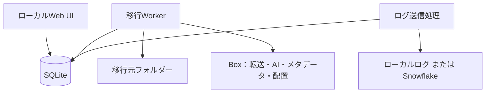

# Shuttle Lite Architecture

現行仕様の確認日: 2026-09-23（実装`cff6760`、schema 10）。操作手順は[README](../README.md)、
設定と抽出の詳細は[metadata-templates.md](metadata-templates.md)を参照する。

## 1. Architecture goals

- macOSで開発・実証できる
- 転送はローカルファイルからBoxへ直接行う。プレビューはBoxの表示機能を利用する
- long-running transferをWeb request lifecycleから分離する
- process crashとunknown API outcomeから復旧できる
- upload、metadata、AI、approval、move、Snowflakeを独立してretryできる
- 基本版だけで成立し、AI Agent Orchestratorを後付けできる

## 2. Logical components



WebとWorkerは別プロセス。Worker内で転送・分類・配置の独立した枠とログ送信を実行する。
BoxとSnowflakeへの接続は、設定に応じて直接または明示プロキシ経由となる。
Next.js Route Handler内で長時間の転送・AI処理を実行しない。

## 3. Repository boundaries

```text
apps/web
  UI、Route Handlers、SSE

apps/worker
  Job claim、queue実行、graceful shutdown

packages/core
  Entity、state、command、policy、error category

packages/db
  SQLite schema、transaction、repository、outbox

packages/box
  CCG、upload、metadata、AI、move、verification

packages/config
  Environment validation、ProxyProfile、secret references

packages/routing
  Extraction schema、destination catalog、approval validation

packages/telemetry
  Progress event、Snowflake payload allowlist、batch sender
```

## 4. Data flow

### 4.1 Scan and plan

1. Webがprofileとjob commandをSQLiteへ保存する
2. Workerがjobをlease付きでclaimする
3. Source rootを再帰scanする
4. Relative path、stat、SHA-1からMigrationItemを作る
5. Preflight結果を保存する

### 4.2 Upload and reconciliation

1. Workerがsourceのstatを再確認する
2. deterministicなstaging nameを決める
3. DirectまたはChunked Uploadを開始する
4. Box response、session、part、progressを保存する
5. 結果が不明ならstaging folderを直接listしてreconcileする
6. sizeとSHA-1を確認する

Searchの即時反映へ依存しない。staging folderの直接listingで見つけられる
deterministicな名前を使う。

候補:

```text
{migrationItemId}__{sanitizedOriginalName}
```

最終配置前にoriginal nameへ戻す。同名競合時はjobのconflict policyに従い、
連番を付けて両方残すか、skipして後で対応する。上書きはしない（D-017）。

### 4.3 Metadata

1. 設定で有効にした既存のBoxテンプレートを候補にする。
2. AIが文書本文と候補の名前・項目からテンプレートを選び、その項目を抽出する。
3. テンプレート・抽出値・抽出状況をSQLiteへ保存し、承認を待つ。
4. 承認後、項目定義と承認内容の整合性を確認してBoxへ付与し、ファイルをmoveする。
5. Box側の値を読み直して検証する。テンプレート未選択なら業務メタデータは付けない。

新方式では共通の移行管理テンプレートを付けない。旧共通メタデータ方式で作成済みのジョブは、
転送検証後にprovenanceを付ける従来の処理を維持する。判定は`job_metadata`の行の有無で行う。

## 5. AI routing

### 5.1 Why staging is required

Box AI Structured ExtractにはBox file IDが必要なため、local fileを直接分類しない。
accessを限定したstagingへ一度uploadしてからAIを実行する。

### 5.2 Extraction schema

```text
documentType
businessDomain
businessIdentifier
effectiveDate
suggestedDestinationKey
suggestedTags
reason
metadataTemplateId（新方式で候補がある場合）
```

`suggestedDestinationKey`はdestination catalogのenumに限定する。
`metadataTemplateId`は有効な候補IDと`NONE`に限定し、アプリでも候補外を採用しない。
テンプレート決定後の項目抽出は別リクエストで行う。分類結果はファイルの同一性と候補を含むキーで
キャッシュし、項目抽出の再試行だけなら分類を呼び直さない。
手動でテンプレートを変更した場合も、AIが有効なら自動で項目を抽出する。

### 5.3 Decision ownership

- Box AI: extractionとsuggestion
- Application policy: allowed destinationの検査
- Local operator: value修正とapproval
- Worker: approval recordの再検査とmove

AI responseだけではmoveできない。backendがapproval recordとcurrent file stateを
照合して初めてmove commandを実行する。

### 5.4 Fallback

以下はmanual reviewへ送る。

- AI disabled
- Unsupported file type
- AIが対象外・出力不正の場合（新方式の項目抽出では「抽出失敗」として下書きを残す）
- Missing result
- Unknown destination key
- Stale approval
- File version changed

一時的なAPIエラーはretry、認証・権限などの恒久的エラーはfailedとして扱う。
承認画面からの抽出失敗は下書きの抽出状況へ記録し、詳細から再抽出できる。

## 6. Approval model

MVPのWeb UIはlocal-onlyで、enterprise user authenticationを保証しない。

保存する値:

- `operatorLabel`
- approval time
- approved file ID
- approved version IDまたはSHA-1
- approved metadata snapshot
- approved destination folder ID

発表では「Box user本人確認済みapproval」と主張しない。本番化ではBox OAuth、
enterprise SSO、またはBox Taskを候補とする。

## 7. State model

```text
DISCOVERED
→ HASHING
→ PREFLIGHT
→ READY
→ UPLOADING
→ STAGED
→ TRANSFER_VERIFIED
→ PROVENANCE_PENDING
→ PROVENANCE_APPLIED
→ AI_PENDING
→ AI_COMPLETED
→ REVIEW_REQUIRED
→ APPROVED
→ MOVING
→ FINAL_VERIFY
→ COMPLETED
```

Side states:

```text
PAUSED
RETRY_WAIT
UNKNOWN_OUTCOME
NEEDS_REVIEW
SKIPPED
FAILED
```

`COMPLETED`はfinal destination、content、required metadata、approval recordの
検証後だけ設定する。

## 8. SQLite concurrency

- WAL mode
- Local disk only
- Short transactions
- Busy timeout
- Worker leaseによる二重claim防止
- State updateとoutbox insertを同一transactionで実行
- UIは直接stateを書き換えずcommandを追加する

想定tables:

```text
migration_profiles
migration_jobs
migration_items
upload_sessions
upload_parts
extraction_results
routing_decisions
job_commands
migration_events
snowflake_outbox
```

## 9. Proxy architecture

一つの`ProxyProfile`をdomain modelとして持つ。

```text
url
authMode
usernameSecretRef
passwordSecretRef
caBundlePath
noProxy
```

各clientへ明示的に変換する。

- Box auth/API/upload/AI client
- Snowflake client
- 将来のLLM client

各SDKが同一のproxy設定を共有できるとは仮定しない。TLS verificationを無効に
しない。proxyは前提条件ではなく、既定は直接接続である。proxy経由を義務付ける
環境向けに、proxy未設定時にdirect fallbackしない`required` modeを用意する。

## 10. Throughput architecture

- File queueとAI queueを分離
- File concurrencyとpart concurrencyをglobal budgetで制御
- 429の`Retry-After`を優先
- Backoffへjitterを加える
- Per-user token bucket
- API request count、latency、429をeventとして記録
- Source disk readとnetwork uploadにbackpressureをかける

複数Service AccountはMVPで利用しない。

## 11. Snowflake outbox

1. Domain eventとoutbox rowを同一SQLite transactionで保存
2. Senderが未送信rowをbatch claim
3. Snowflakeへidempotentなevent ID付きで送る
4. 成功後にdelivered timeを記録
5. 結果不明時は同じevent IDで再送

Snowflake側でevent IDの重複を除外またはmergeできるschemaを採用する。

Snowflake backlogはjob failureではなく、別のdelivery statusとして表示する。

## 12. Box folder layout

```text
/Shuttle Lite
├── _staging/{jobId}
├── _needs_review
├── _reports
└── destinations
    ├── Legal/Contracts
    ├── Finance/Invoices
    ├── HR/Employee Records
    ├── IT/Runbooks
    └── Sales/Proposals
```

Service Accountにはこのrootだけを必要なroleで共有する。stagingが親folderの
collaborationを通じて想定外の利用者へ見えないか、Box環境作成時に確認する。

## 13. Failure boundaries

- Source failure: read、permission、file changed
- Proxy failure: connect、407、certificate、timeout
- Box auth failure: token、scope、folder permission
- Upload failure: 409、429、5xx、session expiry
- Integrity failure: size、SHA-1
- Metadata failure: schema、409、permission
- AI failure: unsupported、pending representation、timeout、invalid output
- Approval failure: stale file、stale destination、invalid operator input
- Move failure: conflict、permission
- Snowflake failure: connect、write、unknown outcome

各categoryにretryable/non-retryableとoperator actionを定義する。
