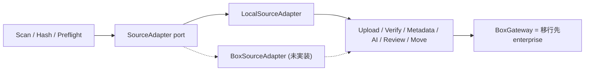

# Box-to-Box migration の設計

更新日: 2026-09-14

## 位置づけ

Box Shuttleのself-service対応sourceは
[file server、OneDrive、Google Drive、Dropbox、SharePoint Online など](https://docs.box.com/en/box-fundamentals/for-admins/getting-started/migrate-content)
で、Box-to-Boxは含まれない。企業合併や分社でenterpriseを跨いでcontentを移す需要は
あるため、ここにgapがある。

今回のMVPではBox-to-Boxを実装しない。代わりに、実装が **source adapterの追加だけ** で
済むようにseamを切ってある。upload、retry、reconciliation、review、approval、
telemetry、reportの層は一行も変更せずに再利用できる。

## Seam



Portは [apps/worker/src/source/adapter.ts](../apps/worker/src/source/adapter.ts) にある。

```text
verifyRoot()                      root到達性
scan()                            item列挙
stat(ref)                         処理直前の再確認
digest(ref)                       SHA-1
openStream(ref)                   Direct Upload用
readRange(ref, offset, length)    Chunked Upload用
```

`BoxGateway` は既にinstanceを2つ作れる設計なので、移行元をread scope、移行先を
write scopeで並べるだけでよい。

## Box APIで裏が取れていること

- [Download file](https://developer.box.com/reference/get-files-id-content) は
  `range: bytes={start}-{end}` header による部分取得をサポートする。
  `readRange` をそのまま実装できる。
- 同APIはfileがまだ準備できていない場合 `202` と `Retry-After` を返す。
  既存の `AI_NOT_READY` と同じ扱いで待てばよい。
- File objectは `sha1` を返す。つまり **移行元Boxの SHA-1 と移行先Boxの SHA-1 を
  突き合わせるだけで完全性検証が成立する**。local sourceと違い自前でhashを計算する
  必要がない。
- Chunked uploadのpartは `content-range` と `digest: sha=...` を要求するため、
  range downloadとそのまま噛み合う。

副次的な効果として、移行元のfileは既にBox file IDを持つので **Box AIをstaging前に
実行できる**。local→Boxでstagingが必須だった理由（AIにfile IDが要る）は
Box-to-Boxでは消える。

## 運べるもの、運べないもの

| 対象 | 可否 | 補足 |
|---|---|---|
| File本体（最新版） | 運べる | SHA-1で検証可能 |
| Folder階層 | 運べる | 移行先で再構築する |
| Metadataの値 | 運べる | templateはenterprise scopeなので移行先で作り直す |
| Version history | 実質不可 | 順に版を積むことは可能だが、各版の作成者と日時は再現できない |
| Ownership / 作成者 | 不可 | 移行先のservice account所有になる。Shuttleのownership管理は再現できない |
| Permission / collaboration | 不可 | identityを対応付けてAPIで作り直す |
| Retention / legal hold / 分類ラベル | 不可 | |
| Shared link URL | 不可 | 新しいURLになる |
| Comment / task | 作り直し | APIで再作成できる |
| Box Notes | 要注意 | Box native形式。copy/uploadでの忠実性を要検証 |
| Trash、event履歴 | 不可 | |

`POST /files/:id/copy` がenterpriseを跨いで使えるかは公式docsに可否の記載を
見つけられなかった。確実なのはdownload + uploadの経路なので、そちらを前提に設計する。
copy APIのcross-enterprise可否はspike項目として残す。

## 実装する場合の作業

1. `BoxSourceAdapter` を追加する（folder再帰列挙、range download、sha1はfile objectから）
2. `MigrationProfile` にsource種別と移行元root folder IDを追加する
3. Worker起動時に移行元用の `BoxGateway` を生成する（scopeはread only）
4. `migrationItemId` の導出元を移行元file IDにする（pathより安定する）
5. Metadata移送: 移行元のinstanceを読み、移行先templateへ書く
6. Reportに移行元file IDと移行先file IDの対応を追加する

想定 1〜1.5日。律速は実装ではなく、移行元・移行先の2 tenantとCCG application承認。

## 対象外を明示する

Box-to-Boxを扱う場合も、permission、ownership、version history、retentionは
[要件 section 9](requirements.md) のとおり対象外とする。「Box Shuttleの代替」ではなく
「Shuttleが対応しない範囲の限定的な移行path」と説明する。
