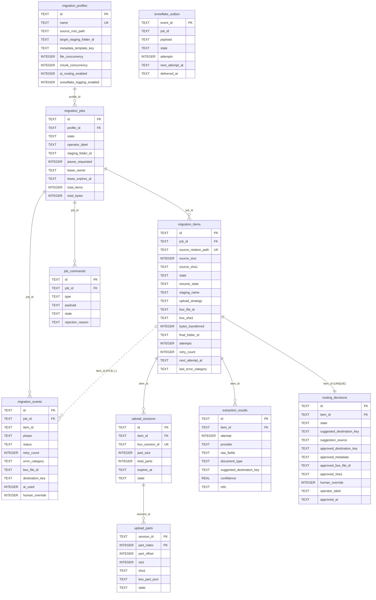
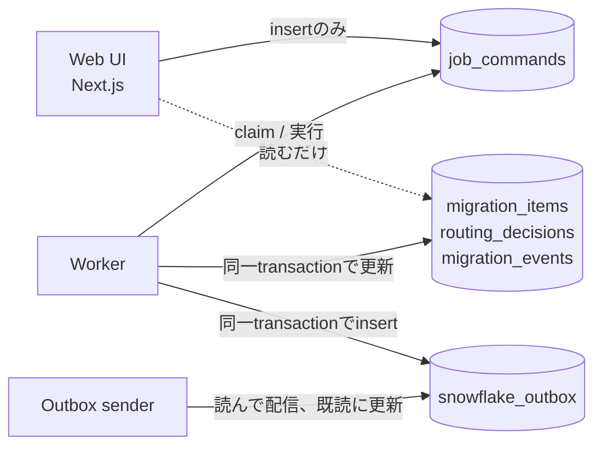
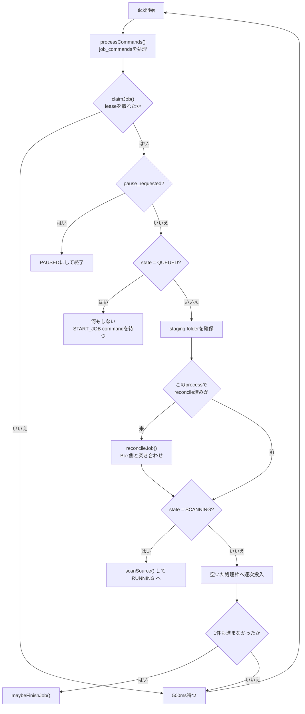
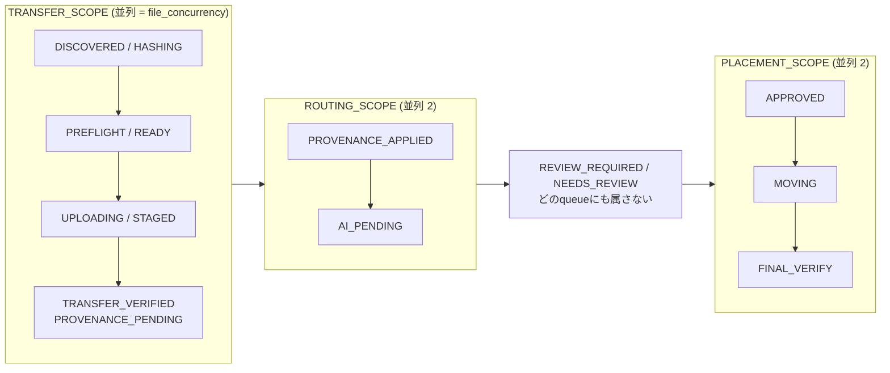
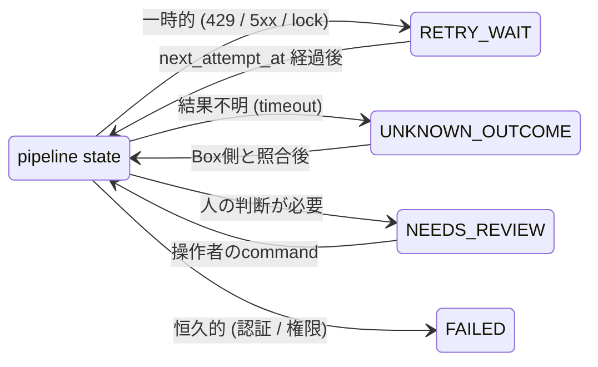
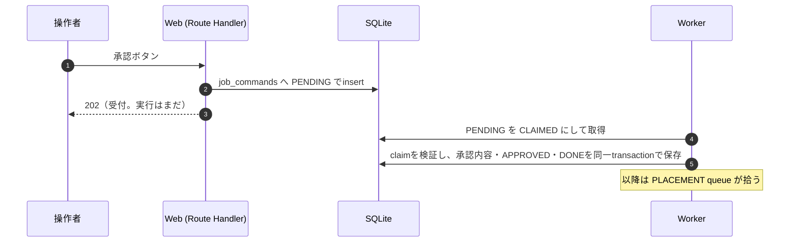

# データモデルと処理の流れ

更新日: 2026-09-23（schema 10）

[architecture.md](architecture.md) は設計意図を書いた文書である。この文書は
**実装されたコードから起こした**もので、SQLiteのtable構成と、workerが実際に
何をどの順で動かしているかを示す。

- schemaの正本: `packages/db/src/migrations.ts`
- state機械の正本: `packages/core/src/state.ts`
- 実行loopの正本: `apps/worker/src/runtime.ts` と `apps/worker/src/pipeline.ts`

## ER図

以下は転送・承認の中心となるテーブルと主要列の関係を示す。全列を網羅する図ではない。
後から追加した設定・メタデータ・復旧用テーブルは次の一覧に示す。完全な定義は`migrations.ts`を参照する。

`snowflake_outbox` は外部keyを持たない。中身は送信用に
allowlistで整形済みのJSON payloadで、migration本体が消えても配信の記録として
独立に残る必要がある。`event_id` は `migration_events.id` と同じ値を使うので、
送信先で重複を識別できる。配信は再送を含み、SnowflakeではEVENT_IDによるMERGE、
ローカルJSONLではeventIdを使った重複識別を前提とする。

## 各tableの役割

| Table | 役割 |
|---|---|
| `migration_profiles` | 移行元folder、staging先、並列数、AI有無の設定。credentialは持たない |
| `migration_jobs` | 1回の移行。worker leaseとpause要求もここ |
| `migration_items` | file 1件。**stateの正本**。ここを見れば1 fileがどこまで進んだか分かる |
| `upload_sessions` | 50MB超のchunked upload session。process再起動をまたいで再利用する |
| `upload_parts` | chunkごとの記録。途中停止時にBox側のlist partsと突き合わせる |
| `extraction_results` | Box AIの応答。attemptごとに追記するので、何回目の抽出かが残る |
| `routing_decisions` | AIの提案と**人の承認**。item 1件に1行（UNIQUE制約） |
| `job_commands` | UIからの操作要求。claim tokenと期限を持ち、処理中断から回復する |
| `migration_events` | 進捗と失敗の履歴。UI表示とreportの元 |
| `snowflake_outbox` | ローカルJSONLまたはSnowflakeへ送る整形済みpayloadの待ち行列 |
| `job_destinations` | 移行ごとに選んだBoxの既存配置先候補 |
| `runtime_settings` | 共通のAI分類・並列数・ログ出力先と保存revision |
| `metadata_settings` | アプリで使用するテンプレートの一覧と保存revision |
| `job_metadata` | 移行で使うテンプレート定義。行なしは旧方式、空の一覧は新方式の未設定 |
| `item_metadata` | ファイルごとのテンプレート・抽出値・revision・抽出状況 |
| `business_metadata_writes` | この移行がBoxへ書き込んだテンプレートの記録。書き込み結果不明からの回復に使う |
| `test_deleted_files` | テスト終了で削除したファイルの記録 |
| `worker_heartbeats` | ワーカーの最終応答時刻 |

分類応答の`raw_fields`には選択された`metadataTemplateId`も保持する。`classification_key`は
ファイル同一性と分類条件を含むキャッシュキー。項目抽出の再試行で分類APIを重複実行しない。
`item_metadata.extraction_status`は抽出成功・空・失敗・手動入力を区別する。

## 誰が何を書くか

**書き込む主体が分かれている。** 次の図は移行処理の状態更新について示す。
設定・移行の作成時にはWeb側も対応する設定テーブル・profile・jobを保存する。

UIから `migration_items.state` を書き換える経路は存在しない。承認ボタンを押すと
`job_commands` に `APPROVE_ITEM` が1行入るだけで、実際にBox内moveするのはworkerで
ある。workerは現在のファイル状態と承認revisionを照合して古い操作を拒否する。

## Workerのloop

`apps/worker/src/runtime.ts` のジョブ処理の概略は次のとおり。実行中はleaseと稼働時刻も更新する。

`claimJob` はSQLite上のleaseで、既定30秒。**1 workerが同時に扱うjobは1つ**。lease
があるので、workerを2つ起動しても同じjobを二重に処理しない。

## 3つのqueue

ここが「uploadとAI処理は別queue」の実体である。`pipeline.ts` がstateを3つの
scopeに分けていて、`runtime.ts` が各scopeの空いた枠へ逐次投入する。
分類や配置が遅くても、転送枠が空けば次のファイルを進める。ファイル並列数は1〜5、
分類と配置は各2。分割転送の1〜4枠は全ファイルで共有する。
操作・設定変更時は投入を止め、実行中のステップの終了を待って反映する。

**`REVIEW_REQUIRED` はどのscopeにも入っていない。** つまりworkerは構造的にこの状態
のitemを拾えない。`APPROVE_ITEM` commandが `REVIEW_REQUIRED → APPROVED` に動かして
初めて、PLACEMENT queueが拾えるようになる。「承認前にmoveしない」がコメントや
if文ではなく、queueの定義そのもので保証されている。

## stateとstepの対応

`pipeline.ts` の `STEPS` がそのままこの表である。

| state | 実行される関数 | queue |
|---|---|---|
| `DISCOVERED` / `HASHING` | `hashItem` | TRANSFER |
| `PREFLIGHT` | `preflightItem` | TRANSFER |
| `READY` / `UPLOADING` | `uploadItem` | TRANSFER |
| `STAGED` | `verifyTransfer` | TRANSFER |
| `TRANSFER_VERIFIED` / `PROVENANCE_PENDING` | `applyProvenance` | TRANSFER |
| `PROVENANCE_APPLIED` / `AI_PENDING` | `runRouting` | ROUTING |
| `AI_COMPLETED` | （なし。`runRouting` 内でREVIEW_REQUIREDへ） | — |
| `REVIEW_REQUIRED` | （なし。人の承認待ち） | — |
| `APPROVED` | `placeItem` | PLACEMENT |
| `MOVING` / `FINAL_VERIFY` | `finalVerify` | PLACEMENT |
| `COMPLETED` | （終端） | — |

同じ関数が2つのstateに紐づいているのは、途中で落ちた場合にそのstepの手前から
やり直せるようにするためである。新方式の`applyProvenance`はBoxへ書き込まず、
互換性のため残した状態を通過する。業務メタデータの付与は承認後の`placeItem`で行う。
その書き込みに失敗しても、アップロード工程へ戻さず配置工程から回復する。
旧方式だけは`applyProvenance`で共通メタデータを付与する。

## 失敗したときの寄り道

pipeline stateが16個、その外にside stateが6個ある。失敗すると
`handleStepFailure` がerror categoryを見て3つに振り分ける。

side stateに逃げるとき、**元のstateを `resume_state` 列に書き残す**。復帰時は
`effectiveState()` がそれを読んで、落ちたstepだけをやり直す。`RETRY_WAIT` と
`UNKNOWN_OUTCOME` を分けているのは、結果が不明な通信はretryの前にBox側を
listingして照合しないと重複を作りうるからである。

`attempts` はstepごとにリセットされ、`retry_count` は通算で残る。前者はretry
予算、後者は指標という使い分けである。

## commandの一生

command typeは10種類（`START_JOB` `PAUSE_JOB` `RESUME_JOB` `RESCAN_JOB`
`RETRY_FAILED` `RETRY_ITEM` `APPROVE_ITEM` `SKIP_ITEM` `SEND_TO_REVIEW`
`GENERATE_REPORT`）。実行できない状態のcommandは `REJECTED` になり、
`rejection_reason` が残る。

## telemetryが失われない理由

`migration_items` のstate更新と `snowflake_outbox` へのinsertを、**同一の
SQLite transaction**で確定している（`packages/db/src/store.ts` の
`transitionItem`）。そのため次の2つが同時に成り立つ。

- Snowflakeが停止していてもmigrationは進む（outboxが伸びるだけ）
- migrationが進んだのにeventが記録されていない、という状態が起きない

送信はworkerとは別のloop（`OutboxSender`）が担当し、`event_id` で冪等に配信する。
送る項目は `packages/telemetry/src/payload.ts` のallowlistだけで、file名、
絶対path、credential、AI応答の全文は入らない。
